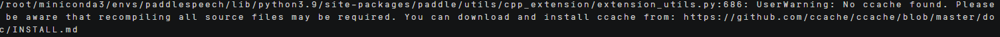
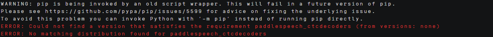
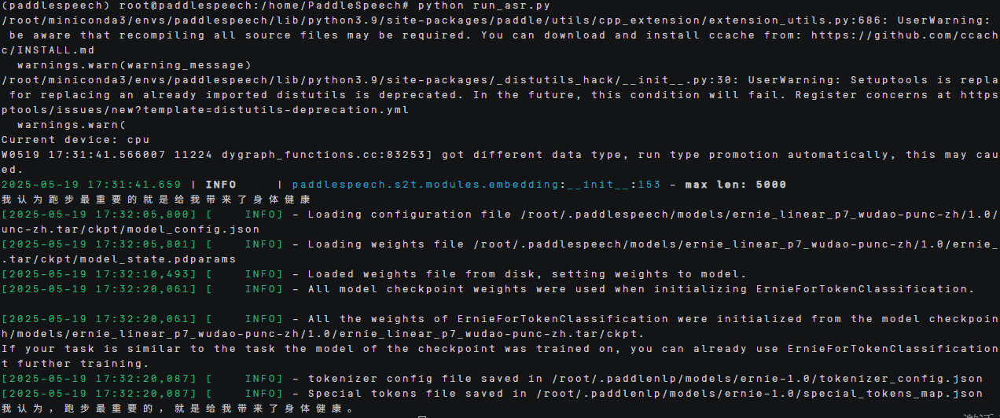
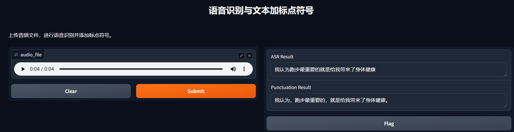

# PaddleSpeech部署指南


## ‌一、环境准备


### 更新系统


#### EulerOS2.0


```
yum -y update  
yum -y upgrade
```


#### Ubuntu 24.04


```
apt-get -y update
export DEBIAN_FRONTEND=noninteractive
apt-get -y -o Dpkg::Options::="--force-confold" dist-upgrade
```


## ‌二、安装docker


#### EulerOS2.0


参考：[安装Docker](https://support.huaweicloud.com/bestpractice-hce/hce_bp_0002.html)

#### Ubuntu 24.04


参考：[安装Docker](https://www.runoob.com/docker/ubuntu-docker-install.html)

## **三、安装conda**


```
mkdir -p ~/miniconda3

wget https://repo.anaconda.com/miniconda/Miniconda3-latest-Linux-aarch64.sh -O ~/miniconda3/miniconda.sh

bash ~/miniconda3/miniconda.sh -b -u -p ~/miniconda3

rm -f ~/miniconda3/miniconda.sh

source ~/miniconda3/bin/activate

conda init --all
```


创建虚拟环境

```
conda create -n paddlespeech python=3.9
```


## **四、源码下载**

### **1.下载PaddlePaddle的源码**

 

```
下载源码 https://github.com/PaddlePaddle/PaddleSpeech.git

安装依赖：

pip install paddlepaddle -f https://www.paddlepaddle.org.cn/whl/linux/aarch64/ -i https://pypi.tuna.tsinghua.edu.cn/simple

pip install pytest-runner -i https://pypi.tuna.tsinghua.edu.cn/simple

\#安装cmake

sudo dnf install -y cmake  #EulerOS

pip install scipy==1.13.1 numpy==1.24.0 #安装之前需要先卸载numpy的2.0版本，因为会导致不匹配

pip install paddlespeech -i https://pypi.tuna.tsinghua.edu.cn/simple

python -m pip install paddlepaddle==3.0.0b2 -i https://www.paddlepaddle.org.cn/packages/stable/cpu/

conda install -y -c conda-forge sox libsndfile swig bzip2 #运行会报错

pip install sox -i https://pypi.tuna.tsinghua.edu.cn/simple

pip install h5py -i https://pypi.tuna.tsinghua.edu.cn/simple

conda install -c conda-forge librosa   

conda install -c conda-forge matplotlib==3.8.4

pip install onnxruntime==1.15.0 -i https://pypi.tuna.tsinghua.edu.cn/simple

pip install pytest-runner -i https://pypi.tuna.tsinghua.edu.cn/simple

\# 请确保目前处于PaddleSpeech项目的根目录

pip install . -i https://pypi.tuna.tsinghua.edu.cn/simple

pip install gradio==3.44.4 -i https://pypi.tuna.tsinghua.edu.cn/simple #安装配套的版本
```

 

### **2.下载模型**

```
wget https://paddlespeech.bj.bcebos.com/PaddleAudio/zh.wav
```


## **五、启动项目**

### **1.修改代码**
修改代码为[run_asr](../scripts/run_asr.py)

[gradio_show](../scripts/gradio_show.py)

### **2.推理**

运行代码为：

```
python run_asr.py
```

```
EulerOS报错：ImportError: /usr/lib64/libstdc++.so.6: version `GLIBCXX_3.4.29' not found (required by /root/miniconda3/envs/paddlespeech/lib/python3.9/site-packages/matplotlib/_path.cpython-39-aarch64-linux-gnu.so)
```

解决方法：

```
find /root/miniconda3/envs/paddlespeech/ -name "libstdc++.so.6"

echo 'export LD_LIBRARY_PATH=/root/miniconda3/envs/paddlespeech/lib:$LD_LIBRARY_PATH' >> ~/.bashrc

source ~/.bashrc

echo $LD_LIBRARY_PATH
```

第一次运行会有警告和报错：



这个警告是没有ccache，然后进行安装。

```
conda install -c conda-forge ccache
```



```
python -m pip install --upgrade setuptools
```

报错是找不到满足要求的pspeech_ctcdecoders版本

```
cd third_party/ctc_decoders

bash setup.sh

pip install --user . -i https://pypi.tuna.tsinghua.edu.cn/simple
```

然后重新运行，其结果是

 


web代码推理：

```
python gradio_show.py
```

运行之后就能打开ip+7863了

 

然后从本地上传需要测试的音频文件，执行就能获得语音识别的结果。
