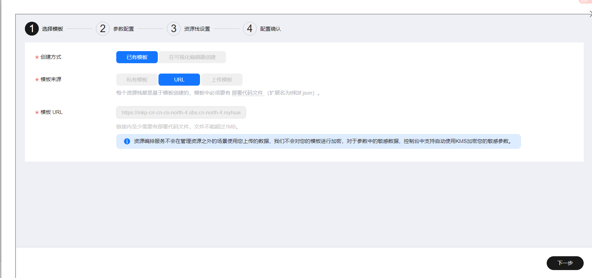

# PaddleSpeech语音识别工具使用指南

# 一、商品链接

[PaddleSpeech语音识别工具](https://marketplace.huaweicloud.com/hidden/contents/1bad99c5-7fa7-4ac7-9f7e-a2f79e1e7802#productid=OFFI1136589149251743744)

# 二、商品说明

PaddleSpeech是由PaddlePaddle推出的开源语音人工智能套件，是一款轻量级语音识别应用，旨在帮助用户能够准确快速获取识别后的文本，适用于会议记录、音频转写和内容归档等多种场景。本商品通过鲲鹏服务器+EulerOS2.0进行安装部署

# 三、商品购买

您可以在云商店搜索 **PaddleSpeech语音识别工具**。

其中，地域、规格、推荐配置使用默认，购买方式根据您的需求选择按需/按月/按年，短期使用推荐按需，长期使用推荐按月/按年，确认配置后点击“立即购买”。

## 3.1 使用 RFS 模板直接部署

 
必填项填写后，点击 下一步

创建直接计划后，点击 确定 

点击部署，执行计划

如下图“Apply required resource success. ”即为资源创建完成 

## 3.2ECS 控制台配置

### 准备工作

在使用ECS控制台配置前，需要您提前配置好 **安全组规则**。

> **安全组规则的配置如下：**
>
> - 入方向规则放通端口7863，必须包含这些端口才能正常访问使用
> - 入方向规则放通 CloudShell 连接实例使用的端口 `22`，以便在控制台登录调试
> - 出方向规则一键放通

### 创建ECS

前提工作准备好后，选择 ECS 控制台配置跳转到[购买ECS](https://support.huaweicloud.com/qs-ecs/ecs_01_0103.html) 页面，ECS 资源的配置如下图所示：

选择CPU架构 

选择服务器规格 

选择镜像 

其他参数根据实际请客进行填写，填写完成之后，点击立即购买即可 

> **值得注意的是：**
>
> - VPC 您可以自行创建
> - 安全组选择 [**准备工作**](#准备工作) 中配置的安全组；
> - 弹性公网IP选择现在购买，推荐选择“按流量计费”，带宽大小可设置为5Mbit/s；
> - 高级配置需要在高级选项支持注入自定义数据，所以登录凭证不能选择“密码”，选择创建后设置；
> - 其余默认或按规则填写即可。

# 商品使用

## TigerBot使用

启动PaddleSpeech

conda activate paddlespeech

进入对应的目录：

cd /home/PaddleSpeech

其次运行web代码：

python gradio_show.py

然后就能够在https://ip:7863网页打开应用

然后就能够上传音频文件进行使用了。

 

### 参考文档

[PaddleSpeech官方文档](https://github.com/PaddlePaddle/PaddleSpeech)
